# 🐍 LegacyBridge OSS COBOL Migration Agents

**AI-powered COBOL to Java (Quarkus) migration framework built on Python using [`Atomic Agents`](https://github.com/BrainBlend-AI/atomic-agents) and [`Instructor`](https://github.com/567-labs/instructor) for seamless orchestration, structured validation, and automatic cost tracking.**

> **What is Quarkus?** Quarkus is a modern, cloud-native Java framework optimized for Kubernetes and serverless environments. It delivers ultra-fast startup times, low memory footprint, and native compilation capabilities, making it ideal for microservices and enterprise applications. Our migration generates production-ready Quarkus code with proper annotations, dependency injection, and RESTful service structures.

---

## 🧭 About this Project

This repository is a **modern Python rewrite** of the original Microsoft project [Legacy Modernization Agents (C#)](https://github.com/Azure-Samples/Legacy-Modernization-Agents), which provided an AI-assisted approach to COBOL-to-Java migration using [Semantic Kernel](https://github.com/microsoft/semantic-kernel).

**What's new in this version:**
- Re-implemented from scratch using Python
- Built on the cutting-edge [`Atomic Agents`](https://github.com/BrainBlend-AI/atomic-agents) orchestration framework
- Uses [`Instructor`](https://github.com/567-labs/instructor) for structured LLM interactions and validation
- Offers automatic **token and cost tracking** through instructor hooks
- Fully containerized with Docker for simple, consistent deployment

---

## 🏛️ About the Original Microsoft Project

The original [Legacy Modernization Agents](https://github.com/Azure-Samples/Legacy-Modernization-Agents) repository represents a pioneering Microsoft initiative developed in collaboration with [Bankdata](https://www.bankdata.dk/) to demonstrate AI-powered COBOL-to-Java migration capabilities. Here are its key characteristics:

### 🔧 Technical Architecture
- **Framework**: Built on Microsoft's **Semantic Kernel** with .NET 8.0
- **AI Orchestration**: Uses Semantic Kernel Process Functions for workflow management
- **Language**: C# with extensive Azure OpenAI integration
- **Model Requirements**: Specifically designed for GPT-4.1 with 1M tokens/minute capacity
- **Container Support**: Includes Dev Container configuration for Visual Studio Code

### 🎯 Core Features & Design Philosophy
- **Multi-Agent System**: Three specialized agents (CobolAnalyzer, JavaConverter, DependencyMapper)
- **Explicit Configuration**: Two-file config system (`ai-config.env` + `ai-config.local.env`)
- **Semantic Kernel Integration**: Tightly integrated with Microsoft's SK framework
- **Enterprise Focus**: Designed for large-scale COBOL modernization projects
- **Azure-Centric**: Optimized for Azure OpenAI services with specific deployment requirements

### 🛠️ Management & Operation
- **CLI Tool**: `doctor.sh` script for setup, testing, and migration management
- **Interactive Setup**: Guided configuration wizard for Azure OpenAI credentials
- **Robust Validation**: Comprehensive system validation and diagnostics
- **Performance Metrics**: Detailed migration statistics and cost tracking

### 🏢 Project Background
- **Collaboration**: Joint effort between Microsoft Global Black Belt team and Bankdata
- **Open Source Initiative**: Released to gather real COBOL code contributions from the community
- **Research Focus**: Demonstrates practical applications of AI agents in legacy system modernization
- **Industry Impact**: Featured in Microsoft and Bankdata blog posts showcasing AI-driven modernization

### 📊 Proven Results
- **Scale Tested**: Successfully processed 102 COBOL files → 99 Java files
- **Cost Effective**: $0.31 for complete migration (205 API calls)
- **High Success Rate**: 97% successful conversion rate
- **Processing Time**: ~1.2 hours for full enterprise migration

---

## 🧩 Why Rewrite It?

While the original C# project offered a strong foundation, this Python version introduces key innovations that dramatically improve **developer experience**, **observability**, **AI reliability**, and **deployment simplicity**:

| Benefit | Python Edition | C# Edition |
|--------|----------------|------------|
| AI Orchestration | `Atomic Agents` framework | Semantic Kernel framework |
| LLM Integration | ✅ Instructor + optimized prompts | ⚠️ Manual prompt engineering |
| Token Tracking | ✅ Instructor hooks | ✅ EnhancedLogger + ChatLogger |
| Schema Validation | ✅ Pydantic + retries | ⚠️ Manual response parsing |
| Provider Support | ✅ Multi-provider via Instructor | ⚠️ Azure OpenAI focused |
| Containerization | ✅ Docker-first | ✅ Dev Container + Docker |
| Logging | ✅ Advanced w/ conversation logs | ✅ Advanced w/ structured logs |
| Extensibility | ✅ Plugin-like agents | ⚠️ Hardcoded C# classes |

### 🚀 Enhanced LLM Integration & Reliability

This Python rewrite leverages **[Instructor](https://github.com/567-labs/instructor)** library for superior LLM interactions:

- **📝 Optimized Prompts**: All agent prompts have been refined for better accuracy and consistency
- **🛡️ Structured Communication**: Instructor enforces strict input/output schemas via Pydantic, reducing AI errors
- **🔄 Automatic Retries**: Built-in retry logic with validation ensures robust responses
- **🌐 Multi-Provider Support**: Easy switching between OpenAI, Azure OpenAI, Anthropic, and other providers
- **⚡ Performance**: Structured responses eliminate manual parsing, improving speed and reliability

### 🧩 Atomic Agents Framework Advantages

Built on **[Atomic Agents](https://github.com/BrainBlend-AI/atomic-agents)**, which offers significant improvements over frameworks like LangChain and CrewAI:

#### 🎯 **IPO Model (Input-Process-Output)**
- **Input**: Pydantic data structure validation
- **Process**: Pure agent and tool operations 
- **Output**: Validated Pydantic output structures
- **Result**: Crystal-clear data flow with no hidden abstractions

#### ⚛️ **Atomicity & Single Responsibility**
- **Modular Design**: Each agent has one clear responsibility
- **Zero Dependencies**: Components can be mixed and matched freely
- **Full Control**: No black-box operations - you control every step
- **Easy Testing**: Atomic components are simple to test and debug

#### 🔧 **Reduced Complexity**
- **No Excessive Abstractions**: Simple, composable components
- **Transparent Operations**: Everything is visible and customizable
- **Developer-Friendly**: Focus on solving problems, not fighting the framework

By combining modular AI agents with deep observability and automated hooks, this version offers a faster, more resilient, and more scalable modernization pipeline.

---

## 🚀 Quick Start with Docker

**Docker is the recommended way to run COBOL Migration Agents.** It provides a self-contained environment with all dependencies pre-configured.

### 🔧 1. Install & Setup

```bash
# Automated setup
./scripts/docker-setup.sh setup

# Configure AI credentials
nano .env
```

### 🚀 2. Run the Migration

```bash
./scripts/docker-setup.sh validate
./scripts/docker-setup.sh samples
./scripts/docker-setup.sh migrate
```

More information:
- 📘 [DOCKER_QUICKSTART.md](DOCKER_QUICKSTART.md)
- 📘 [DOCKER_GUIDE.md](DOCKER_GUIDE.md)

### 🔍 Docker Configuration Advantages

Our Docker-first approach provides enterprise-grade benefits:

1. **🔒 Isolation**: Consistent, reproducible environment across all platforms
2. **📦 Portability**: Runs anywhere Docker is installed—development to production
3. **🛡️ Security**: Secure containers with non-root user configuration
4. **📈 Scalability**: Production-ready for horizontal scaling
5. **⚡ Ease of Use**: Automated scripts handle all operations seamlessly
6. **🐛 Debug Support**: Development mode with complete debugging tools

### 🚀 Production-Ready Deployment

The containerized setup is optimized for:
- **Docker Swarm** for clustered deployments
- **Kubernetes** with additional manifests
- **CI/CD Pipelines** via GitHub Actions/GitLab CI
- **Cloud Platforms**: AWS ECS, Azure Container Instances, GCP Cloud Run

---

## 🧠 Architecture Overview

The framework is based on a modular **multi-agent architecture**, each agent specializing in one phase of the migration process.

### 👇 Agent Responsibilities

| Agent | Role |
|-------|------|
| `CobolAnalyzerAgent` | Parses COBOL structure, detects business logic, calculates complexity |
| `JavaConverterAgent` | Converts COBOL to modern Java using Quarkus best practices |
| `DependencyMapperAgent` | Maps relationships between files, generates Mermaid dependency diagrams |

---

## 🔄 End-to-End Migration Process


---

## 📊 AI Token & Cost Tracking

With **automatic Instructor hooks**, every AI call is traced and measured.

### Metrics Collected

- Tokens: prompt, completion, total
- Cost: calculated based on model used
- Latency: per-agent performance
- Hook efficiency: % of calls automatically captured

### Sample Report

```markdown
Total API Calls: 15
Hook-Captured Calls: 14 (93%)
Total Tokens: 32,014
Estimated Cost: $0.18
```

---

## 🧪 Development Setup (Optional, without Docker)

> Only recommended for advanced users.

### Requirements

- Python 3.12+
- pip or poetry

### Setup

```bash
pip install -e .
cp config/settings.env.example config/settings.local.env
nano config/settings.local.env

python -m cobol_migration_agents.cli main   --cobol-source ./data/cobol-source   --java-output ./data/java-output
```

---

## 📁 Output Artifacts & Value

### ✅ Migration Reports (`migration_report_*.md`)
- Conversion rate, token use, complexity score
- AI performance per file and per agent
- Code expansion ratio (COBOL → Java)

### 💬 AI Conversation Logs (`conversation_log_*.md`)
- Timestamped reasoning by agents
- Latency and confidence per file
- Debugging and auditing visibility

### ☕ Enterprise-Ready Java Code
- Fully annotated Quarkus-compatible services
- Type-safe, idiomatic Java code
- Clean microservice structure, ready for REST APIs

---

## 💡 Why Use This Tool?

| Feature | Value |
|--------|-------|
| ⏱️ **Speed** | Migration in minutes, not months |
| 💸 **Cost** | Orders of magnitude lower than traditional manual rewrites |
| 🔍 **Auditability** | Full AI trace and confidence logs |
| 🧪 **Accuracy** | Enterprise-grade output with >95% correctness potential, supported by auto-review and AI-driven suggestions for human validation |
| 🧱 **Scalability** | Agent-based architecture supports horizontal scale |
| ⚙️ **Maintainability** | Modern, clean Java output with Javadoc |
| 🔐 **Compliance** | Traceability from COBOL to Java |

---

## 🤝 Contributing

This project is open to contributions! We welcome:
- New agent ideas
- Enhanced AI prompts and schema validations
- Better test coverage or integration scripts
- Community feedback and testing

---

## 📄 License

MIT License — same as the original C# version.

## ⚖️ Disclaimer

This project is an **independent creation by Lorenzo Toscano**, developed entirely separate from any professional activities or organizational affiliations. This work serves as a **technical demonstration** of how agentic AI configurations can effectively accelerate reverse engineering and code migration processes.

The implementation showcases the potential of modern AI agentic applications to transform complex legacy modernization challenges into streamlined, observable, and maintainable workflows. This project is intended for educational and research purposes, demonstrating best practices in AI-assisted software migration.

---

## 🧭 Summary

This Python rewrite brings the power of modern AI frameworks to COBOL modernization. With structured orchestration, token-efficient performance, and fully observable AI agents, it turns a complex legacy transformation into a **repeatable, scalable, and cost-effective pipeline**.

**🚀 Ready to modernize your mainframe? Start now with Docker and Python!**

---

## 📖 Appendix

### 🎯 Original C# Multi-Agent Architecture

Based on the Microsoft's original implementation, here's how the three specialized agents are orchestrated:

```mermaid
graph TB
    subgraph USER_INPUT ["👤 User Input"]
        COBOL_FILES["📁 COBOL Files<br/>(.cbl, .cpy)"]
        CONFIG["⚙️ Configuration<br/>(ai-config.local.env)"]
    end
    
    subgraph SEMANTIC_KERNEL ["🧠 Semantic Kernel Framework"]
        KERNEL_BUILDER["🔧 Kernel Builder<br/>• Azure OpenAI Connection<br/>• HTTP Client Setup<br/>• Model Configuration"]
        MIGRATION_PROCESS["🎯 Migration Process<br/>• Agent Orchestration<br/>• Workflow Management<br/>• Progress Tracking"]
    end
    
    subgraph AI_AGENTS ["🤖 Specialized AI Agents"]
        COBOL_ANALYZER["🔍 CobolAnalyzerAgent<br/>• Structure Analysis<br/>• Variable Mapping<br/>• Logic Flow Detection<br/>• Copybook References"]
        
        JAVA_CONVERTER["☕ JavaConverterAgent<br/>• COBOL→Java Translation<br/>• Quarkus Integration<br/>• Best Practices<br/>• Error Handling"]
        
        DEPENDENCY_MAPPER["🗺️ DependencyMapperAgent<br/>• Relationship Analysis<br/>• Mermaid Diagrams<br/>• Usage Patterns<br/>• Metrics Calculation"]
    end
    
    subgraph HELPER_SERVICES ["🛠️ Helper Services"]
        FILE_HELPER["📁 FileHelper<br/>• Directory Scanning<br/>• File I/O Operations<br/>• Output Structure"]
        
        ENHANCED_LOGGER["📊 EnhancedLogger<br/>• API Call Tracking<br/>• Progress Monitoring<br/>• Cost Analysis"]
        
        CHAT_LOGGER["💬 ChatLogger<br/>• Conversation Recording<br/>• Markdown Export<br/>• JSON Statistics"]
    end
    
    subgraph OUTPUT_ARTIFACTS ["📤 Output Artifacts"]
        JAVA_FILES["☕ Java Files<br/>• Quarkus Services<br/>• Package Structure<br/>• Annotations"]
        
        REPORTS["📋 Reports<br/>• migration-report.md<br/>• dependency-map.json<br/>• conversation-log.md"]
        
        LOGS_DIR["📂 Logs Directory<br/>• API Calls<br/>• Performance Metrics<br/>• Error Tracking"]
    end
    
    %% Flow Connections
    USER_INPUT --> SEMANTIC_KERNEL
    SEMANTIC_KERNEL --> AI_AGENTS
    AI_AGENTS --> HELPER_SERVICES
    HELPER_SERVICES --> OUTPUT_ARTIFACTS
    
    %% Detailed Agent Flow
    MIGRATION_PROCESS --> COBOL_ANALYZER
    COBOL_ANALYZER --> DEPENDENCY_MAPPER
    DEPENDENCY_MAPPER --> JAVA_CONVERTER
    
    %% Helper Service Connections
    COBOL_ANALYZER -.-> ENHANCED_LOGGER
    JAVA_CONVERTER -.-> ENHANCED_LOGGER
    DEPENDENCY_MAPPER -.-> ENHANCED_LOGGER
    
    COBOL_ANALYZER -.-> CHAT_LOGGER
    JAVA_CONVERTER -.-> CHAT_LOGGER
    DEPENDENCY_MAPPER -.-> CHAT_LOGGER
    
    %% Styling
    classDef userStyle fill:#e3f2fd,stroke:#1976d2,stroke-width:2px,color:#0d47a1
    classDef kernelStyle fill:#f1f8e9,stroke:#689f38,stroke-width:2px,color:#1b5e20
    classDef agentStyle fill:#fff3e0,stroke:#f57c00,stroke-width:2px,color:#e65100
    classDef helperStyle fill:#f3e5f5,stroke:#7b1fa2,stroke-width:2px,color:#4a148c
    classDef outputStyle fill:#e8f5e8,stroke:#2e7d32,stroke-width:2px,color:#1b5e20
    
    class COBOL_FILES,CONFIG userStyle
    class KERNEL_BUILDER,MIGRATION_PROCESS kernelStyle
    class COBOL_ANALYZER,JAVA_CONVERTER,DEPENDENCY_MAPPER agentStyle
    class FILE_HELPER,ENHANCED_LOGGER,CHAT_LOGGER helperStyle
    class JAVA_FILES,REPORTS,LOGS_DIR outputStyle
```

