# 🐍 LegacyBridge OSS COBOL Migration Agents

**AI-powered COBOL to Java (Quarkus) migration framework built on Python using [`Atomic Agents`](https://github.com/BrainBlend-AI/atomic-agents) and [`Instructor`](https://github.com/567-labs/instructor) for seamless orchestration, structured validation, and automatic cost tracking.**

> **What is Quarkus?** Quarkus is a modern, cloud-native Java framework optimized for Kubernetes and serverless environments. It delivers ultra-fast startup times, low memory footprint, and native compilation capabilities, making it ideal for microservices and enterprise applications. Our migration generates production-ready Quarkus code with proper annotations, dependency injection, and RESTful service structures.

---

## 🧭 About this Project

This repository is a **modern Python rewrite** of the original Microsoft project [Legacy Modernization Agents (C#)](https://github.com/Azure-Samples/Legacy-Modernization-Agents), which provided an AI-assisted approach to COBOL-to-Java migration using [Semantic Kernel](https://github.com/microsoft/semantic-kernel).

The Python implementation leverages the Atomic Agents framework to provide a more modular, schema-driven approach to AI agent management while maintaining all the functionality of the original C# system.

**What's new in this version:**
- Built on [`Atomic Agents`](https://github.com/BrainBlend-AI/atomic-agents) for standardized AI orchestration
- Uses [`Instructor`](https://github.com/567-labs/instructor) for structured LLM interactions with automatic validation
- **Automatic token and cost tracking** through instructor hooks
- **Docker-first** deployment with simplified setup
- **Enhanced observability** with comprehensive logging and conversation tracking

---

### About the Original Microsoft Project

The original [Legacy Modernization Agents](https://github.com/Azure-Samples/Legacy-Modernization-Agents) represents a pioneering Microsoft initiative that emerged from a strategic collaboration with Denmark's [Bankdata](https://www.bankdata.dk/). This groundbreaking project demonstrates how AI agents can revolutionize legacy COBOL modernization at enterprise scale.

#### Technical Foundation

Built on Microsoft's **Semantic Kernel framework** with .NET 8.0, the system leverages **Process Functions** to orchestrate three specialized AI agents: CobolAnalyzer, JavaConverter, and DependencyMapper. The architecture is specifically optimized for **GPT-4.1 models** running at enterprise capacity (1M tokens/minute) and integrates seamlessly with **Azure OpenAI services**. Development is streamlined through Visual Studio Code Dev Containers, ensuring consistent environments across teams.

#### Enterprise-Grade Design

The project's **multi-agent architecture** embodies a clear separation of concerns, with each agent specializing in distinct phases of the migration pipeline. Configuration management follows enterprise patterns with a **dual-file system** (template + local credentials), while the included **`doctor.sh` CLI tool** provides comprehensive setup, validation, and migration management capabilities. This design philosophy prioritizes **observability, reliability, and scalability** for large-scale modernization initiatives.

#### Industry Impact & Proven Results

As a **joint research initiative** between Microsoft's Global Black Belt team and Bankdata, this project has garnered significant industry attention through featured blog posts and conference presentations. The **open-source release** was strategically designed to engage the broader COBOL community, gathering real-world code samples to further refine the AI models. 

With **enterprise-validated results**, the system has demonstrated remarkable efficiency: processing **102 COBOL files into 99 Java files** in just **~1.2 hours** at **sub-dollar costs**, achieving an impressive **97% successful conversion rate**. This proves the practical viability of AI-assisted legacy modernization at enterprise scale.

---

## 🧩 Why Rewrite It?

While the original C# project offered a strong foundation, this Python version introduces key innovations that dramatically improve **developer experience**, **observability**, **AI reliability**, and **deployment simplicity**:

| Benefit | Python Edition | C# Edition |
|--------|----------------|------------|
| AI Orchestration | `Atomic Agents` framework | Semantic Kernel framework |
| LLM Integration | ✅ Instructor + optimized prompts | ⚠️ Manual prompt engineering |
| Token Tracking | ✅ Instructor hooks | ✅ EnhancedLogger + ChatLogger |
| Schema Validation | ✅ Pydantic + retries | ⚠️ Manual response parsing |
| Provider Support | ✅ Multi-provider via Instructor | ⚠️ Azure OpenAI focused |
| Containerization | ✅ Docker-first | ✅ Dev Container + Docker |
| Logging | ✅ Advanced w/ conversation logs | ✅ Advanced w/ structured logs |
| Extensibility | ✅ Plugin-like agents | ⚠️ Hardcoded C# classes |

### Enhanced LLM Integration & Reliability

This Python rewrite leverages **[Instructor](https://github.com/567-labs/instructor)** library for superior LLM interactions:

- **Optimized Prompts**: All agent prompts have been refined for better accuracy and consistency
- **Structured Communication**: Instructor enforces strict input/output schemas via Pydantic, reducing AI errors
- **Automatic Retries**: Built-in retry logic with validation ensures robust responses
- **Multi-Provider Support**: Easy switching between OpenAI, Azure OpenAI, Anthropic, and other providers
- **Performance**: Structured responses eliminate manual parsing, improving speed and reliability

### Atomic Agents Framework Advantages

Built on **[Atomic Agents](https://github.com/BrainBlend-AI/atomic-agents)**, which offers significant improvements over frameworks like LangChain and CrewAI through its **IPO model** (Input-Process-Output) with Pydantic validation, **atomic components** with single responsibilities, and **transparent operations** without hidden abstractions.

This approach delivers a faster, more resilient, and scalable modernization pipeline with full developer control.

### Key Technical Improvements

1. **Schema-Driven Architecture**: Pydantic models ensure strong typing and validation across all data flows
2. **Asynchronous Processing**: Full async/await support for improved performance and scalability
3. **Enhanced CLI Experience**: Rich interface with progress bars, styling, and interactive feedback
4. **Service-Oriented Design**: Clear separation of concerns with modular, testable components
5. **Automated Observability**: Built-in hooks capture token usage, costs, and conversation flows automatically

---

## 🚀 Quick Start with Docker

**Docker is the recommended way to run COBOL Migration Agents.** It provides a self-contained environment with all dependencies pre-configured.

### 1. Install & Setup

```bash
# Automated setup
./scripts/docker-setup.sh setup

# Configure AI credentials (main configuration)
cp config/settings.env.example config/settings.local.env
nano config/settings.local.env

# Configure Docker-specific settings (optional)
nano .env
```

### 2. Run the Migration

```bash
./scripts/docker-setup.sh validate
./scripts/docker-setup.sh samples
./scripts/docker-setup.sh migrate
```

More information:
- 📘 [DOCKER_QUICKSTART.md](DOCKER_QUICKSTART.md)
- 📘 [DOCKER_GUIDE.md](DOCKER_GUIDE.md)
- 📋 [PARAMETERS.md](PARAMETERS.md) - Complete configuration reference

### Docker Configuration Advantages

Our Docker-first approach provides enterprise-grade benefits:

1. **Isolation**: Consistent, reproducible environment across all platforms
2. **Portability**: Runs anywhere Docker is installed—development to production
3. **Security**: Secure containers with non-root user configuration
4. **Scalability**: Production-ready for horizontal scaling
5. **Ease of Use**: Automated scripts handle all operations seamlessly
6. **Debug Support**: Development mode with complete debugging tools

### Production-Ready Deployment

The containerized setup is optimized for:
- **Docker Swarm** for clustered deployments
- **Kubernetes** with additional manifests
- **CI/CD Pipelines** via GitHub Actions/GitLab CI
- **Cloud Platforms**: AWS ECS, Azure Container Instances, GCP Cloud Run

---

## 🏗️ System Architecture & Key Features

The framework is based on a modular **multi-agent architecture**, each agent specializing in one phase of the migration process. For a detailed technical diagram of the Python implementation, see the [Architecture Diagram in Appendix](#-python-implementation-architecture).

### Agent Responsibilities

| Agent | Role |
|-------|------|
| `CobolAnalyzerAgent` | Parses COBOL structure, detects business logic, calculates complexity |
| `JavaConverterAgent` | Converts COBOL to modern Java using Quarkus best practices |
| `DependencyMapperAgent` | Maps relationships between files, generates Mermaid dependency diagrams |

---

### End-to-End Migration Process


### AI Token & Cost Tracking

With **automatic Instructor hooks**, every AI call is traced and measured.

### Metrics Collected

- Tokens: prompt, completion, total
- Cost: calculated based on model used
- Latency: per-agent performance
- Hook efficiency: % of calls automatically captured

### Output Artifacts & Value

#### Migration Reports (`migration_report_*.md`)
- Conversion rate, token use, complexity score
- AI performance per file and per agent
- Code expansion ratio (COBOL → Java)

#### AI Conversation Logs (`conversation_log_*.md`)
- Timestamped reasoning by agents
- Latency and confidence per file
- Debugging and auditing visibility

#### Enterprise-Ready Java Code
- Fully annotated Quarkus-compatible services
- Type-safe, idiomatic Java code
- Clean microservice structure, ready for REST APIs

---

## 🧪 Development Setup (Optional, without Docker)

> Only recommended for advanced users.

### Requirements

- Python 3.12+
- pip

### Setup

```bash
pip install -e .

# Copy template to create your local configuration
cp config/settings.env.example config/settings.local.env
nano config/settings.local.env

python -m cobol_migration_agents.cli main   --cobol-source ./data/cobol-source   --java-output ./data/java-output
```

> 📋 **Configuration Help**: For detailed explanations of all configuration parameters, see [PARAMETERS.md](PARAMETERS.md)

---

## 💡 Why Use This Tool?

| Feature | Value |
|--------|-------|
| ⏱️ **Speed** | Migration in minutes, not months |
| 💸 **Cost** | Orders of magnitude lower than traditional manual rewrites |
| 🔍 **Auditability** | Full AI trace and confidence logs |
| 🧪 **Accuracy** | Enterprise-grade output with >95% correctness potential, supported by auto-review and AI-driven suggestions for human validation |
| 🧱 **Scalability** | Agent-based architecture supports horizontal scale |
| ⚙️ **Maintainability** | Modern, clean Java output with Javadoc |
| 🔐 **Compliance** | Traceability from COBOL to Java |

---

## 🤝 Contributing

The modular design makes it easy to add new agents, models, services, or CLI commands. Contributions are welcome—whether it's new agent types, improved prompts, better tests, or feedback from users.

---

## 📄 License

MIT License — same as the original C# version.

### Disclaimer

This repository is an **independent creation by [Lorenzo Toscano](https://it.linkedin.com/in/lorenzotoscano)**, developed entirely separate from any professional activities or organizational affiliations. This work serves as a **technical demonstration** of how agentic AI configurations can effectively accelerate reverse engineering and code migration processes.

The implementation showcases the potential of modern AI agentic applications to transform complex legacy modernization challenges into streamlined, observable, and maintainable workflows. This project is intended for educational and research purposes, demonstrating best practices in AI-assisted software migration.

---

## 📖 Appendix

### Python Implementation Architecture

This Python version implements a modern, modular architecture using Atomic Agents and Pydantic models:

```mermaid
graph TB
    subgraph ORCHESTRATOR ["🎯 Migration Orchestrator"]
        COORDINATOR["📋 MigrationOrchestrator<br/>• 6-Step Process<br/>• File Discovery<br/>• Workflow Management"]
    end
    
    subgraph AI_AGENTS ["🤖 Atomic Agents"]
        COBOL_AGENT["🔍 CobolAnalyzerAgent<br/>• Structure Analysis<br/>• Variable Mapping<br/>• Logic Flow Detection<br/>• Copybook References"]
        
        JAVA_AGENT["☕ JavaConverterAgent<br/>• COBOL→Java Translation<br/>• Quarkus Integration<br/>• Best Practices<br/>• Error Handling"]
        
        DEPENDENCY_AGENT["🗺️ DependencyMapperAgent<br/>• Relationship Analysis<br/>• Mermaid Diagrams<br/>• Usage Patterns<br/>• Risk Assessment"]
    end
    
    subgraph DATA_MODELS ["📊 Pydantic Models"]
        COBOL_MODELS["📄 COBOL Models<br/>• CobolFile<br/>• CobolAnalysis<br/>• Complexity Metrics"]
        
        JAVA_MODELS["☕ Java Models<br/>• JavaFile<br/>• Quarkus Metadata<br/>• Class Structures"]
        
        SCHEMA_MODELS["🔗 Schema Models<br/>• Input/Output Schemas<br/>• Migration Schemas<br/>• DependencyMap"]
    end
    
    subgraph SERVICES ["🛠️ Core Services"]
        FILE_MANAGER["📁 FileManager<br/>• Async File Operations<br/>• Directory Organization<br/>• Backup & Validation"]
        
        LOGGING_SERVICE["📊 LoggingService<br/>• API Call Tracking<br/>• Conversation Logging<br/>• Cost Analysis"]
        
        REPORT_SERVICE["📋 ReportGenerator<br/>• Markdown Reports<br/>• Migration Statistics<br/>• Recommendations"]
    end
    
    subgraph OUTPUT ["📤 Generated Artifacts"]
        JAVA_OUTPUT["☕ Java Files<br/>• Quarkus Services<br/>• Package Structure<br/>• Annotations"]
        
        REPORTS_OUTPUT["📋 Reports<br/>• Migration Report<br/>• Conversation Logs<br/>• API Statistics"]
        
        DIAGRAMS_OUTPUT["🗺️ Diagrams<br/>• Dependency Maps<br/>• Mermaid Charts<br/>• Risk Analysis"]
    end
    
    %% Main Flow
    COORDINATOR --> AI_AGENTS
    AI_AGENTS --> DATA_MODELS
    DATA_MODELS --> SERVICES
    SERVICES --> OUTPUT
    
    %% Detailed Connections
    COORDINATOR -.-> FILE_MANAGER
    COORDINATOR -.-> LOGGING_SERVICE
    COORDINATOR -.-> REPORT_SERVICE
    
    COBOL_AGENT --> COBOL_MODELS
    JAVA_AGENT --> JAVA_MODELS
    DEPENDENCY_AGENT --> SCHEMA_MODELS
    
    FILE_MANAGER --> JAVA_OUTPUT
    LOGGING_SERVICE --> REPORTS_OUTPUT
    REPORT_SERVICE --> DIAGRAMS_OUTPUT
    
    %% Styling
    classDef orchestratorStyle fill:#e3f2fd,stroke:#1976d2,stroke-width:3px,color:#0d47a1
    classDef agentStyle fill:#fff3e0,stroke:#f57c00,stroke-width:3px,color:#e65100
    classDef modelStyle fill:#f1f8e9,stroke:#689f38,stroke-width:3px,color:#1b5e20
    classDef serviceStyle fill:#f3e5f5,stroke:#7b1fa2,stroke-width:3px,color:#4a148c
    classDef outputStyle fill:#e8f5e8,stroke:#2e7d32,stroke-width:3px,color:#1b5e20
    
    class COORDINATOR orchestratorStyle
    class COBOL_AGENT,JAVA_AGENT,DEPENDENCY_AGENT agentStyle
    class COBOL_MODELS,JAVA_MODELS,SCHEMA_MODELS modelStyle
    class FILE_MANAGER,LOGGING_SERVICE,REPORT_SERVICE serviceStyle
    class JAVA_OUTPUT,REPORTS_OUTPUT,DIAGRAMS_OUTPUT outputStyle
```

